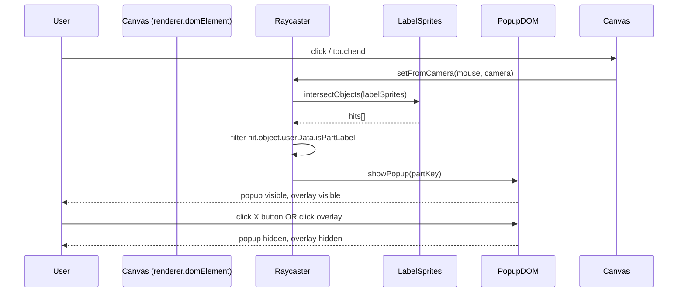

# Design Document: Aircraft Part Labels Popup

## Overview

This feature adds an interactive popup/modal to `markerless.html`. When a user clicks or taps a Three.js sprite label attached to an aircraft part, a popup appears showing the part name and a description of its function. The popup is dismissed via an X button or by clicking the semi-transparent overlay backdrop.

The implementation is entirely self-contained within `markerless.html` — no external files are added. The popup HTML and CSS already exist in the file; the work is wiring up the `PART_DESCRIPTIONS` map, the `addCallout` tagging, and the `setupLabelClick` raycaster IIFE that are partially present but need to be completed and verified.

## Architecture

The feature lives in a single HTML file and follows the existing pattern of the app:

```
markerless.html
├── <style>          — popup/overlay CSS (#partPopup, #partPopupOverlay)
├── <script module>  — Three.js scene, label sprites, raycaster, popup logic
│   ├── PART_DESCRIPTIONS map
│   ├── addCallout()  — creates labeled sprites with userData.partKey / isPartLabel
│   ├── setupLabelClick() IIFE — raycaster + show/hide popup
│   └── load3dAircraft() — calls addCallout for all 6 parts, then setupLabelClick
└── <body>           — #partPopupOverlay, #partPopup DOM elements
```

No new files, no new dependencies. Three.js `Raycaster` is already imported.



## Components and Interfaces

### DOM Elements (already in markerless.html)

| Element | ID | Role |
|---|---|---|
| Popup container | `#partPopup` | Modal dialog, `display:none` / `.visible` class |
| Overlay backdrop | `#partPopupOverlay` | Full-viewport semi-transparent backdrop |
| Popup title | `#popupTitle` | Displays the part name (e.g. `AILERONS`) |
| Popup body | `#popupBody` | Displays the part description text |
| Close button | `#popupClose` | X button inside popup header |

Visibility is toggled by adding/removing the `.visible` CSS class, which switches `display` from `none` to `block`.

### JavaScript Functions

**`showPopup(key: string): void`**
- Looks up `key` in `PART_DESCRIPTIONS`
- Sets `popupTitle.textContent` and `popupBody.textContent`
- Adds `.visible` to `#partPopup` and `#partPopupOverlay`

**`hidePopup(): void`**
- Removes `.visible` from `#partPopup` and `#partPopupOverlay`

**`setupLabelClick(): void`** (IIFE, called once per model load)
- Removes previous `window.__labelClickHandler` from `renderer.domElement` to prevent listener stacking
- Creates a `THREE.Raycaster` and `THREE.Vector2` for mouse coords
- On `click` / `touchend`: normalizes pointer coords, calls `raycaster.intersectObjects(labelSprites, false)`, finds first hit with `userData.isPartLabel === true`, calls `showPopup`
- Guards against opening a second popup while one is already visible

**`addCallout(target, text, offset): void`**
- Creates a sprite via `makeLabel(text, '#ffffff')`
- Sets `spr.userData.partKey = text.toUpperCase()` and `spr.userData.isPartLabel = true`
- Adds sprite and a connecting line to the model

### PART_DESCRIPTIONS Map

```js
const PART_DESCRIPTIONS = {
  'AILERONS':  'Located on the outer part of each wing...',
  'ELEVATORS': 'Found on the horizontal tail...',
  'RUDDER':    "Positioned on the vertical tail...",
  'FLAPS':     'Located on the inner section of the wings...',
  'SLATS':     'Installed on the front edge of the wings...',
  'SPOILERS':  'Panels on the top of the wings...',
};
```

Keys are uppercase strings matching `userData.partKey` on each sprite.

## Data Models

### Sprite userData schema

Each label sprite created by `addCallout` carries:

```ts
{
  partKey: string,       // e.g. 'AILERONS' — key into PART_DESCRIPTIONS
  isPartLabel: boolean,  // always true — used by raycaster filter
  texSize: { w: number, h: number }  // canvas dimensions for scale calc
}
```

### Popup visibility state

Managed purely via CSS class presence — no separate JS boolean needed. The raycaster handler checks `popup.classList.contains('visible')` to guard against re-opening while a popup is shown.

### Event listener deduplication

`window.__labelClickHandler` stores the current handler reference. On each model reload, the previous handler is removed before a new one is attached:

```js
if (window.__labelClickHandler) {
  renderer.domElement.removeEventListener('click', window.__labelClickHandler);
  renderer.domElement.removeEventListener('touchend', window.__labelClickHandler);
}
```

## Correctness Properties

*A property is a characteristic or behavior that should hold true across all valid executions of a system — essentially, a formal statement about what the system should do. Properties serve as the bridge between human-readable specifications and machine-verifiable correctness guarantees.*

### Property 1: Part description lookup round trip

*For any* `partKey` string that is a valid key in `PART_DESCRIPTIONS`, calling `showPopup(partKey)` should result in `#popupTitle` containing that key and `#popupBody` containing the exact description string stored in `PART_DESCRIPTIONS[partKey]`.

**Validates: Requirements 1.2, 1.3, 2.1–2.6**

---

### Property 2: Popup is blocked while already visible

*For any* sequence of label click events, if the popup is already visible when a second click arrives, the popup title and body should remain unchanged (i.e., the first part's data is not overwritten).

**Validates: Requirements 1.4**

---

### Property 3: Close restores hidden state

*For any* popup that has been shown, clicking the close button or the overlay should result in both `#partPopup` and `#partPopupOverlay` losing the `.visible` class.

**Validates: Requirements 3.2, 4.2**

---

### Property 4: Raycaster only hits tagged sprites

*For any* set of objects in the scene, the raycaster handler should only call `showPopup` when the first intersected object has `userData.isPartLabel === true`; non-label objects must not trigger the popup.

**Validates: Requirements 6.1, 6.3**

---

### Property 5: No listener stacking on model reload

*For any* number of times `load3dAircraft` is called, there should be exactly one `click` and one `touchend` listener on `renderer.domElement` for label detection at any given time.

**Validates: Requirements 6.2**

---

### Property 6: All six parts have descriptions

*For each* of the six part keys (`AILERONS`, `ELEVATORS`, `RUDDER`, `FLAPS`, `SLATS`, `SPOILERS`), `PART_DESCRIPTIONS` must contain a non-empty string value.

**Validates: Requirements 2.1–2.6**

## Error Handling

| Scenario | Behavior |
|---|---|
| `partKey` not found in `PART_DESCRIPTIONS` | `showPopup` returns early; popup is not shown |
| Raycaster produces no hits | Handler exits loop without calling `showPopup` |
| Model load fails | `load3dAircraft` catches and alerts; `setupLabelClick` is never called, so no broken listeners are registered |
| `touchend` fires on overlay/popup | Overlay and popup have higher z-index than canvas; canvas `touchend` is not reached, so no spurious raycaster call |

## Testing Strategy

### Unit tests

Focus on the pure logic functions that can be exercised without a live Three.js scene:

- `PART_DESCRIPTIONS` contains exactly 6 keys with non-empty string values
- `showPopup` sets the correct title and body text for each valid key
- `showPopup` with an unknown key does not mutate the DOM
- `hidePopup` removes `.visible` from both elements
- The guard condition (`popup.classList.contains('visible')`) prevents re-entry

### Property-based tests

Use a property-based testing library (e.g. [fast-check](https://github.com/dubzzz/fast-check) for JavaScript) with a minimum of 100 iterations per property.

Each test is tagged with a comment in the format:
`// Feature: aircraft-part-labels-popup, Property N: <property text>`

| Property | Test description |
|---|---|
| Property 1 | Generate random valid `partKey` from the 6 known keys; assert title and body match `PART_DESCRIPTIONS` |
| Property 2 | Generate random sequences of `showPopup` calls; assert second call while visible does not change DOM content |
| Property 3 | Generate any visible popup state; trigger close; assert `.visible` absent on both elements |
| Property 4 | Generate mock hit lists with mixed tagged/untagged objects; assert `showPopup` is only called for `isPartLabel === true` hits |
| Property 5 | Call `setupLabelClick` N times (random N 1–10); assert exactly 1 listener fires per click event |
| Property 6 | Enumerate all 6 keys; assert each maps to a non-empty string in `PART_DESCRIPTIONS` |

Unit tests and property tests are complementary: unit tests pin down specific examples and edge cases, while property tests verify the general rules hold across all inputs.
